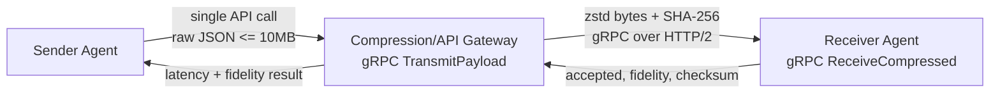

# Single API Compression & Transmission MVP

## Goal

Provide one sender-facing API call that accepts a JSON payload up to 10MB, compresses it with zstd, transmits it over gRPC/HTTP2 to a receiver agent, validates fidelity with SHA-256, and reports latency and compression metrics.

## Architecture



## Flow

1. Sender calls `CompressionGateway.TransmitPayload` once with sender, receiver, and raw JSON bytes.
2. Gateway validates the 10MB limit and required routing fields.
3. Gateway computes the original SHA-256 hash and compresses the payload using zstd `SpeedFastest`.
4. Gateway calls `ReceiverAgent.ReceiveCompressed` with compressed bytes, original size, and checksum.
5. Receiver decompresses, recomputes SHA-256, and reports `100%` fidelity only when size and checksum match exactly.
6. Gateway returns acceptance, latency in microseconds, compression ratio, original checksum, received checksum, and fidelity percentage.

## Tech Stack

- Language: Go.
- Transport: gRPC over HTTP/2.
- Compression: zstd via `github.com/klauspost/compress/zstd`.
- Integrity: SHA-256.
- Staging: in-memory only for MVP; Redis is not required until payload fanout, retries, or durable queues are introduced.

## Run Locally

Start the receiver:

```bash
go run ./cmd/compression-gateway -mode receiver -listen 127.0.0.1:9091
```

Start the gateway:

```bash
go run ./cmd/compression-gateway -mode gateway -listen 127.0.0.1:9090 -receiver 127.0.0.1:9091
```

Run integration tests:

```bash
go test ./...
```

## Install As Windows Services

Run PowerShell as Administrator from the repository root:

```powershell
.\scripts\Install-CompressionMVPServices.ps1
```

The installer builds `cmd/compression-gateway`, copies the executable to `C:\Program Files\InterAI\CompressionMVP`, creates two automatic-start services, and starts them immediately:

- `InterAICompressionReceiver` listens on `127.0.0.1:9091`.
- `InterAICompressionGateway` listens on `127.0.0.1:9090` and depends on the receiver service.

Check service status:

```powershell
Get-Service InterAICompressionReceiver, InterAICompressionGateway
```

Smoke-test the installed services with a generated 10MB JSON payload:

```powershell
.\scripts\Test-CompressionMVPServices.ps1
```

Smoke-test with a specific JSON file:

```powershell
.\scripts\Test-CompressionMVPServices.ps1 -Payload C:\path\to\payload.json
```

Run safe edge cases against the installed services:

```powershell
.\scripts\Test-CompressionMVPEdgeCases.ps1
```

Run service failure and restart-recovery edge cases from an Administrator PowerShell:

```powershell
.\scripts\Test-CompressionMVPEdgeCases.ps1 -IncludeServiceFailureTests
```

Remove both services:

```powershell
.\scripts\Uninstall-CompressionMVPServices.ps1
```

## Acceptance Validation

The Go integration test `TestSingleAPICallCompressesTransmits10MBJSON` generates a 10MB JSON blob and verifies:

- The sender makes one call to `TransmitPayload`.
- Fidelity is at least `95%`; exact checksum equality currently reports `100%`.
- End-to-end gateway latency is at or below `100ms`.
- zstd compression reduces payload size.

## Operational Notes

- Logs are structured JSON through `slog`.
- Payloads above 10MB are rejected before compression.
- gRPC message limits are set to 16MB to accommodate framing overhead.
- The MVP uses a registered gob codec to avoid generated protobuf files while preserving gRPC/HTTP2 transport semantics. A production hardening pass can replace this with checked-in `.proto` and generated stubs without changing the service boundary.
